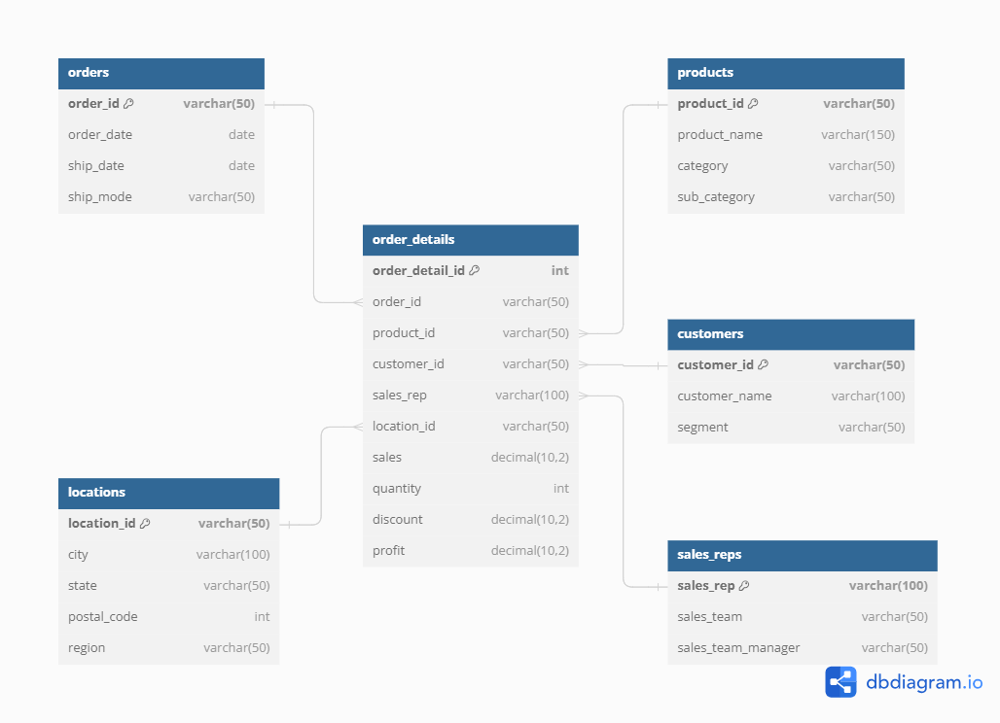

# Projet ETL avec Docker : Intégration et traitement des données de SuperStore

## Description du projet

Ce projet a pour objectif de vous initier à la création d'un pipeline ETL (Extract, Transform, Load) classique en utilisant Docker pour l'intégration et le traitement de données. Vous travaillerez avec des données de ventes issues d'un supermarché fictif appelé **SuperStore**. Le projet vous guidera à travers les étapes de nettoyage des données, de modélisation d'une base de données relationnelle, et de configuration d'un environnement complet pour le traitement des données.

**Note :** Ce projet présente une approche classique du processus ETL. Pour un pipeline ETL plus automatisé et sophistiqué, utilisant des outils comme Apache Airflow, veuillez consulter mes autres projets.

## Structure du projet

Le projet est structuré de la manière suivante :

```plaintext
superstore-etl-docker-project/
├── docker-compose.yml
├── .env
├── cleaner/
│   ├── Dockerfile
│   └── requirements.txt
├── jupyter/
│   ├── Dockerfile
│   └── requirements.txt
├── notebooks/
│   └── analysis.ipynb
└── mysql/
    ├── data/
    │   └── SuperStoreRawData.csv
    └── init.sql
```

### Contenu des dossiers

- **`docker-compose.yml`** : Fichier de configuration Docker Compose pour orchestrer les différents services nécessaires au projet.
- **`cleaner/`** : Contient le script Python (`clean_data.py`) pour nettoyer les données et le `Dockerfile` associé pour créer l'image Docker.
- **`jupyter/`** : Contient le `Dockerfile` et les dépendances pour le service Jupyter Notebook.
- **`notebooks/`** : Contient le notebook Jupyter (`analysis.ipynb`) pour analyser les données après leur importation dans MySQL.
- **`mysql/`** : Contient les données brutes (`SuperStoreRawData.csv`) et le script SQL (`init.sql`) pour créer et initialiser la base de données MySQL.

## Étapes du projet

### 1. Nettoyage des données

Le fichier `SuperStoreRawData.csv` contient des problèmes courants tels que des valeurs manquantes, des duplicata, des valeurs aberrantes, et des formats de données incohérents. Vous devez nettoyer ces données avant de les charger dans la base de données.

- **Script Python** : Le script `clean_data.py` dans le dossier `cleaner/` est utilisé pour effectuer le nettoyage des données. Il est exécuté dans un conteneur Docker défini dans `docker-compose.yml`.

### 2. Modélisation de la base de données

Une fois les données nettoyées, vous devez modéliser une base de données relationnelle dans MySQL :

- **Schéma de la base de données** : La base de données est modélisée pour capturer les relations entre les entités telles que les clients, les produits, les commandes, etc. Vous trouverez le diagramme ERD de cette modélisation ci-dessous.

 

### 3. Écriture du script SQL

Le script `init.sql` dans le dossier `mysql/` est utilisé pour :

- Créer la base de données et les tables.
- Insérer les données nettoyées dans les tables MySQL.
- Assurer que toutes les contraintes nécessaires (clés primaires, clés étrangères) sont en place.

### 4. Configuration de Docker

Le fichier `docker-compose.yml` définit les services nécessaires pour exécuter ce projet :

- **data-cleaner** : Pour nettoyer les données brutes avant leur importation dans MySQL.
- **MySQL** : Pour stocker les données nettoyées.
- **Adminer** : Interface web pour gérer la base de données MySQL.
- **Jupyter Notebook** : Pour analyser les données et exécuter des scripts SQL.

### 5. Chargement des données et analyse

Une fois les données chargées dans MySQL, vous pouvez utiliser Jupyter Notebook pour effectuer des analyses supplémentaires :

- **Notebooks** : Utilisez `analysis.ipynb` pour vous connecter à la base de données MySQL et exécuter des requêtes SQL.
- **Visualisations** : Produisez des visualisations et des rapports basés sur les données chargées.

## Instructions d'exécution

### Prérequis

- Docker et Docker Compose installés sur votre machine.
- Familiarité de base avec SQL, Python, et les concepts de bases de données relationnelles.

### Étapes

1. **Cloner le dépôt** :
   ```bash
   git clone https://github.com/mnassrib/superstore-etl-docker-project.git
   cd superstore-etl-docker-project
   ```

2. **Construire et démarrer les conteneurs Docker** :
   ```bash
   docker-compose up --build
   ```

   - **data-cleaner** : Nettoie les données brutes.
   - **mysql** : Démarre la base de données et charge les données nettoyées.
   - **adminer** : Accessible à `http://localhost:8080` pour gérer la base de données MySQL.
   - **jupyter** : Accessible à `http://localhost:8887` pour l'analyse des données.

3. **Analyser les données** :
   - Accédez à Jupyter Notebook via `http://localhost:8887`.
   - Ouvrez le fichier `analysis.ipynb` et commencez vos analyses.

## Ressources Utiles

- [Documentation MySQL](https://dev.mysql.com/doc/)
- [Documentation Docker](https://docs.docker.com/)
- [Documentation Jupyter Notebook](https://jupyter.org/documentation)


> Ce projet est une excellente introduction à la mise en place d'un pipeline ETL classique. Pour aller plus loin et explorer des solutions ETL plus avancées et automatisées, n'hésitez pas à consulter mes autres projets.
